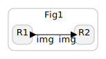

# Dataflow Reactors (Experimental)
This is an experimental idea which I dont fully understand yet. Not yet ready for comments

## The problem
If we move bigger data structures, like an image or a pointcloud, through the ports of a Reactor then the whole image is associated with a single timestamp and is seen as a single transaction. 
However, on the FPGA this is really a stream of pixels (or group of pixels).
Let's assume that we have two HW Reactors R1 and R2, communicating an image through a FIFO buffer. See [Standalone HW Reactors](standalone-hw-reactors.md) for info on interfaces/ports.

The FIFO is not shown. 
If we are to respect Reactor semantics, then R2 cannot start reading the image from the FIFO until the R1 is finished and the whole image is residing in the decoupling FIFO.

## Possible workaround
A possible workaround would be to split the image into rows and have the port carry individual rows. 
Now the reactions are processing a single row each GCC.
By also adding a logical delay at the connection (or a LET on the reaction) we can pipeline the two Reactors (or rather the Reactions).  

This is not so desireable because
1. Do you wanna split images into 

## The proposal

I propose to add a special type of Reactor called Dataflow Reactor it has the following properties;
1. No Actions or Timers
2. Only a single Reaction per Reactor. E.g. no mutual exclusion

The events on the ports of the Dataflow Reactor are untimed which means that the Dataflow Reactors are essentially an untimed domain in the Reactor graph. The Dataflow Reactors are not enabled in a schedule according to the dependencies between Reactors, rather, they are always enabled and synchronize themselves through ready/valid interfaces. They can only communicate througn call-by-value or FIFO interfaces (I think). Dataflow Reactors enables deeply pipelined Reactors which I think is just impossible if the Reactor semantics should be respected. Dataflow Reactors can increase performance at the cost of non-determinism. Connections between Dataflow Reactors and between Dataflow Reactors and normal Reactors should be physical to indicate the non-determinism that it can introduce.

The HW Reactors can only implement true pipelines *inside* the Reactions. However, making a complex pipeline inside a Reaction makes the Critical Path longer and might be undesirable.